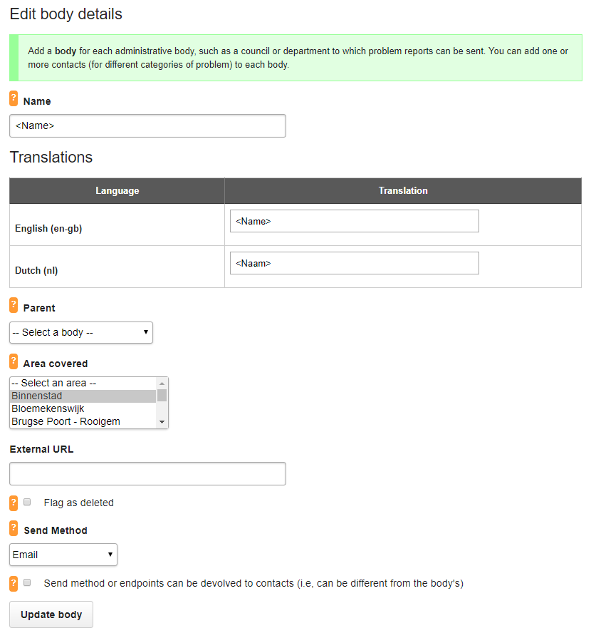
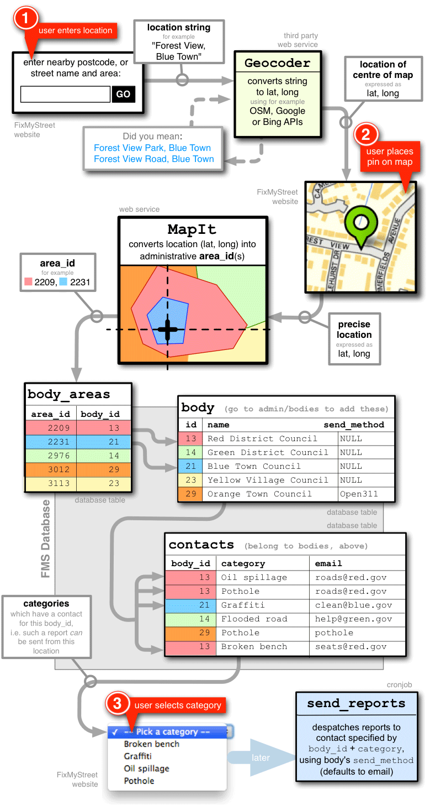

# Open311
[Open311](http://www.open311.org/) refers to a standardized protocol for location-based collaborative issue-tracking. 

The associated [GeoReport v2 Spec](http://wiki.open311.org/GeoReport_v2/) is designed to allow both government and third 
party developers to create new applications and technologies that can integrate directly with official 
contact centers in any government that supports the standard. The current specification is focused on location-based 
non-emergency issues such as graffiti, potholes, and street cleaning.

# FixMyStreet
Check out our demo site [here](http://fms.lab9k.gent).

## Purpose
[FixMyStreet](http://fixmystreet.org/overview/) is a highly customisable opensource project by [mySociety](https://www.mysociety.org/). It aims to 
eliminating a lot of the hassle associated with reporting non-emergency issue to your local government, such as finding 
which government body is responsible for fixing the body, finding contact information, checking if the problem is being 
worked on and so forth.
 
It can also be linked to any government backend system that is Open311 compliant, reducing the administrative work, 
needed to get these problems solved, a lot. However those backend system do not have to support Open311, 
FixMystreet will notify the responsible body with an email.

So reporting and fixing problems was never so easy and transparent!

## Logging in
Anyone can login with an email address with an optional password or login via Facebook or Twitter (using OAuth).

Read more on managing users [here](http://fixmystreet.org/running/users/). 
You may also find the [administrator's manual](http://fixmystreet.org/running/admin_manual/) useful.

## Reports
FixMyStreet makes it easy for anyone to report a problem without having to worry about the 
correct authority to send it to. It takes care of that using the problem’s location and category, and sends a report, by 
email or using a web service such as Open311, to the department or body responsible for fixing it.

Users with certain privileges, such as department employees, can see list of all reports or just the reports of one 
category and solve them. When reports are private only these people and the person who submitted the report can view it, 
post updates.

Read more on sending reports to the responsible authority [here](http://fixmystreet.org/customising/send_reports/).

A few weeks after a person has reported a problem, they are sent a [survey](http://fixmystreet.org/running/surveys/).

## Bodies
The admin of the fixmystreet app can make as many bodies as required. 

A body is the authority to which problem reports will be sent. Each body needs one or more contacts 
(typically these are email addresses) to which particular categories of problem are sent.

When a body is created you can assign all the categories of problem and all regions over which the department 
has jurisdiction. As well as employees of these bodies, who may review, respond, solve, publish,... 
problems for that body.

Read more on managing bodies and contacts [here](http://fixmystreet.org/running/bodies_and_contacts/).

## Assigning reports to bodies
When a user reports a problem they also submit a location and a category. Categories can for instance include fly 
tipping, nuisances, potholes and so forth. FixMystreet will on the bases of the problem's location and the category find 
the responsible body. It does this with a webservice called MapIt, which you can host and configure yourselves.

### Mapit
We have our own [MapIt deployment](https://mapit.lab9k.gent/) with very specific information for Ghent.
It contains all [the 25 official districts of Ghent](https://stad.gent/over-gent-en-het-stadsbestuur/over-gent/gent-25-wijken) 
(with type WIJK) and all [parking zones](https://stad.gent/mobiliteitsplan/het-parkeerplan/webkaart-parkeerplan) 
(with as type the corresponding colour).

Interaction with MapIt goes via http get requests and returns json by default.
The most common query is a lookup by point. With the following format:
 `https://mapit.lab9k.gent/point/[SRID]/[x],[y]`, where SRID is a unique number referring to a particular co-ordinate 
 system; the one you probably are interested in is 4326 for WGS84 normal lon/lat. x and y are the co-ordinates of the 
 point in the co-ordinate system. Note that Mapit works with longitude, latitude in contrast to many other services like 
 google maps where they use latitude, longitude. So x is longitude and y is latitude!

Here is an example URL:

    https://mapit.lab9k.gent/point/4326/3.735406,51.048912

This returns the following json:

    {
        "26": {
            "parent_area": null,
            "generation_high": 1,
            "all_names": {},
            "id": 26,
            "codes": {},
            "name": "Binnenstad",
            "country": "BE",
            "type_name": "Wijken",
            "generation_low": 1,
            "country_name": "België",
            "type": "WIJK"
        },
        "51": {
            "parent_area": null,
            "generation_high": 1,
            "all_names": {},
            "id": 51,
            "codes": {},
            "name": "zone11",
            "country": "BE",
            "type_name": "rood",
            "generation_low": 1,
            "country_name": "België",
            "type": "RED"
        }
    }

## Associated Repositories
+ [FixMyStreet](https://github.com/mysociety/fixmystreet)
+ [FixMyStreet mobile](https://github.com/mysociety/fixmystreet-mobile)
+ [FixMyStreet international](https://github.com/mysociety/fixmystreet-international)
+ [MapIt](https://github.com/mysociety/mapit)
